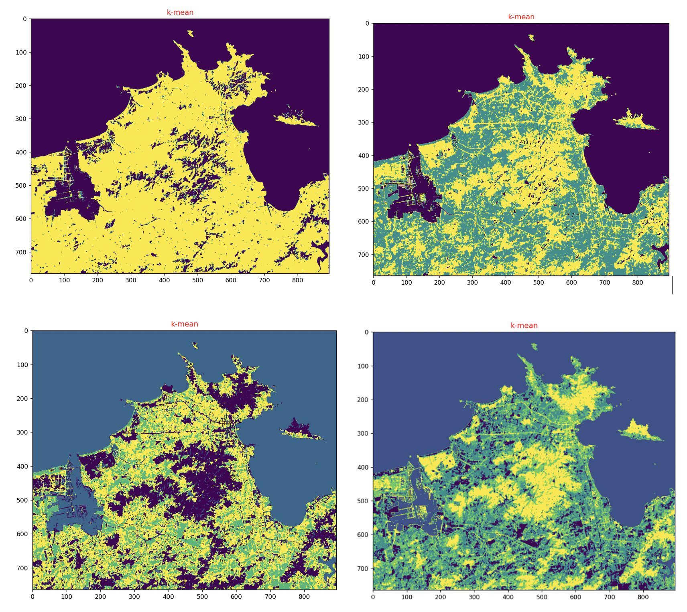
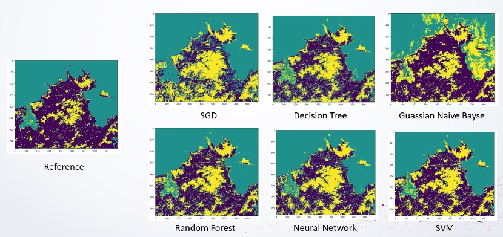

# EE5434 Project

## Remote Sensing Image Classification based on Machine Learning Method

This is a final project in **`EE5434(Machine Learning)`**. Based on the machine learning algorithms learned in this course, the group carried out research on the classification of ground objects in remote sensing images based on machine learning. This project uses unsupervised learning and supervised learning algorithms to classify remote sensing images and discusses the classification results. In terms of unsupervised algorithms, this project uses the K-mean algorithm to achieve unsupervised classification of remote sensing images, and its classification results are used to generate manually labeled data set. In terms of supervised algorithms, this project compared the classification effects of various supervised algorithms and found that the classification effect of the SVM algorithm is more accurate than other algorithms, while the classification effect of the Naive Bayes algorithm is poor. This group has generally completed the set goals of this project.




## Usage

To run the main program：

```bash
python run.py
```

you can change the hyperparameter to select supervised learning or unsupervised learning model.

To use our program, see [baojudezeze](https://github.com/baojudezeze/EE5434_Remote_sensor_image_classification)